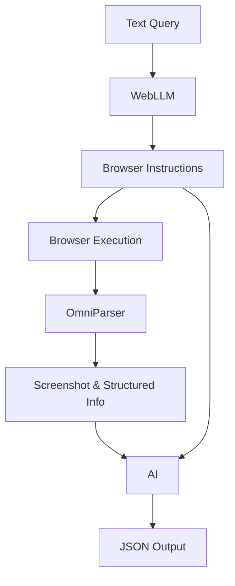

# OneQuery

## Setup

- Requirements: `pip install -r requirements.txt`
- Install browser: `python -m playwright install`

## Usage

### General query with no source to start with

```python
task = "Find 2 recent issues from PyTorch repository."

class IssueModel(BaseModel):
    date: str
    title: str
    author: str
    description: str

class OutputModel(BaseModel):
    issues: list[IssueModel]

scraper = WebScraper(task, None, OutputModel)
scraper.run()
```

### If you know the URL

```python
start_url = "https://in.bookmyshow.com/"
task = "Find 5 events happening in Bangalore this week."

class EventsModel(BaseModel):
    name: str
    date: str
    location: str

class OutputModel(BaseModel):
    events: list[EventsModel]

scraper = WebScraper(task, start_url, OutputModel)
scraper.run()
```

## Architecture



## Stack

- Browser: Puppeteer
- Parser: [OmniParser](https://huggingface.co/spaces/microsoft/OmniParser)
- WebLlama: https://webllama.github.io/
