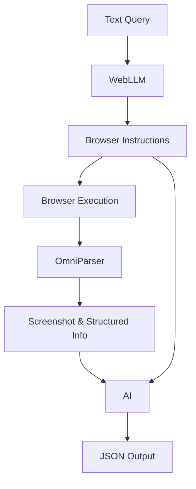

# OneQuery

[](https://github.com/addy999/onequery/blob/main/LICENSE)
[](https://github.com/addy999/onequery/commits/main)
[](https://buymeacoffee.com/adibhatia)

> 🔨 **Note:** This repository is still in development. Contributions and feedback are welcome!

## Setup

- Requirements: `pip install -r requirements.txt`
- Install browser: `python -m playwright install`

## Usage

### General query with no source to start with

```python
task = "Find 2 recent issues from PyTorch repository."

class IssueModel(BaseModel):
    date: str
    title: str
    author: str
    description: str

class OutputModel(BaseModel):
    issues: list[IssueModel]

scraper = WebScraper(task, None, OutputModel)
scraper.run()
```

### If you know the URL

```python
start_url = "https://in.bookmyshow.com/"
task = "Find 5 events happening in Bangalore this week."

class EventsModel(BaseModel):
    name: str
    date: str
    location: str

class OutputModel(BaseModel):
    events: list[EventsModel]

scraper = WebScraper(task, start_url, OutputModel)
scraper.run()
```

### Serving with a REST API

Server:

```bash
pip install fastapi[all]
```

```python
uvicorn server:app --reload
```

Client:

```python
import requests

url = "http://0.0.0.0:8000/scrape"

payload = {
    "start_url": "http://example.com",
    "task": "Scrape the website for data",
    "schema": {
        "title": (str, ...),
        "description": (str, ...)
    }
}

response = requests.post(url, json=payload)

print(response.status_code)
print(response.json())
```

## Architecture

(needs to be revised)

### Flowchart



### Stack

- Browser: Puppeteer
- Parser: [OmniParser](https://huggingface.co/spaces/microsoft/OmniParser)
- WebLlama: https://webllama.github.io/
